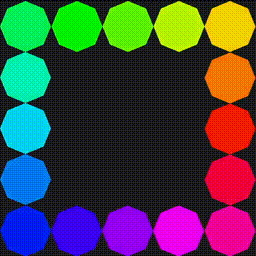

# CybeRGB

<p align="center">
  
</p>

<p align="center"><strong>LED Strip SDK • Firmware • Emulator</strong></p>

A toolkit for developing software and animations for addressable LED strips
(WS2812, SK6812, APA102 and others). **Currently in development!**

## Features
-   Virtual LED controller emulator for development without hardware
-   Clean cross-platform SDK (Linux + Windows)
-   Low-latency streaming protocol
-   Simple architecture

## Components
-   **visualizer** — Simple real-time renderer (**ready**)
-   **service** — High-level IPC services and emulators (**in development**)
-   **firmware** — Code for real hardware controllers (**planned**)

## Quick Start

### Build Visualizer
```sh
cd visualizer
cmake -S . -B build -DCMAKE_BUILD_TYPE=Release
cmake --build build -j
```

### Run with example generator
```sh
./service/emulator.sh rgb-strip ./visualizer/build/visualizer &
python3 service/generator.py <./rgb-strip >./rgb-strip
```

## License
This project is licensed under the **MIT License**. See the
[LICENSE](LICENSE) file for details.
